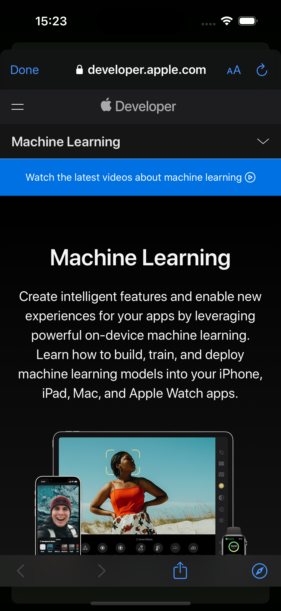

# Apple Frameworks App

## Overview

The Apple Frameworks is a study of ios development to implement UI Components in SwiftUI. The app supports both dark and light modes for a seamless user experience.

## Screenshots
### Light Mode

  
  
  

### Dark Mode

  
  
  

## Installation

To use the Apple Frameworks App, follow these steps:

1. Clone the repository: `git clone https://github.com/nanda-wk/Apple-Frameworks-List.git`
2. Open the project in Xcode.
3. Build and run the app on your iOS device or simulator.